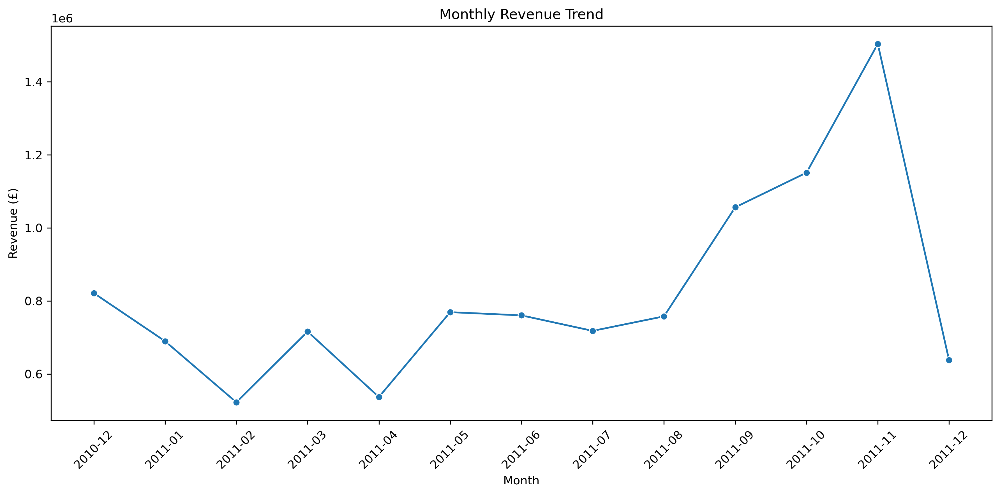
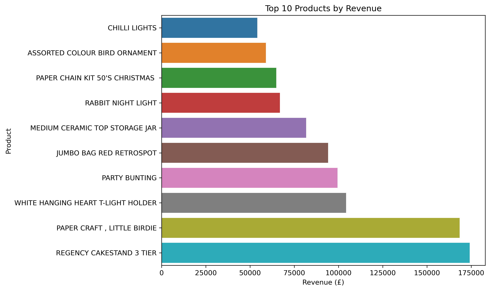
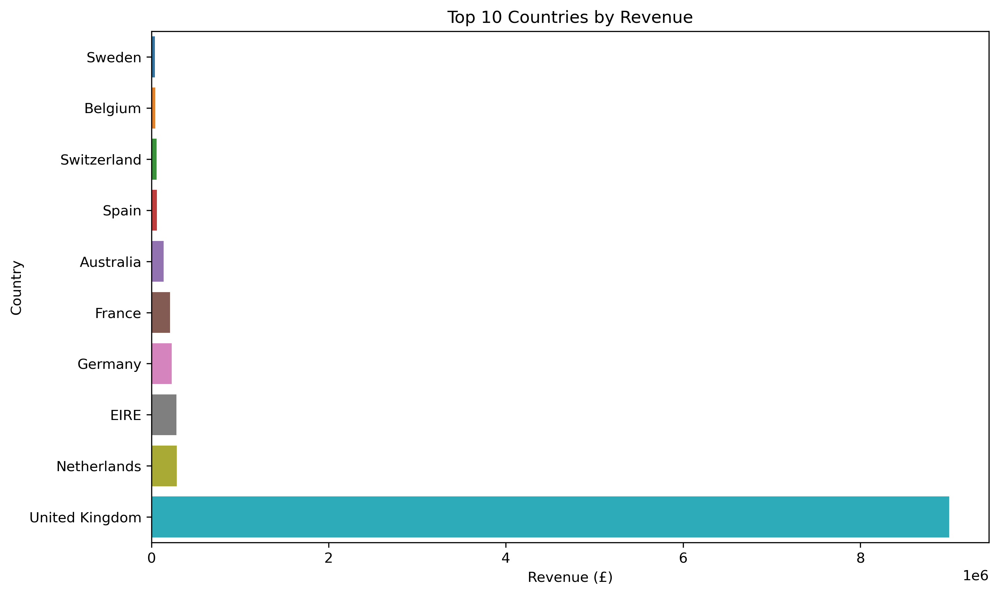

# Online Retail Sales & Customer Analysis

A data analytics project exploring sales performance, product revenue, geographic markets, and customer concentration using transaction-level retail data.

## Overview

This project analyses transaction data from an online retailer to identify patterns in sales performance and customer behaviour.

The analysis focuses on four key questions:

- How does revenue change over time?
- Which products generate the most revenue?
- Which countries contribute the most revenue?
- How concentrated is revenue among customers?

The project uses Python and pandas for data preparation and analysis, with visualisations created using Matplotlib and Seaborn.

---

## Dataset

The dataset contains **541,909 transaction records** across eight variables, including:

- Invoice number
- Product code
- Product description
- Quantity
- Invoice date
- Unit price
- Customer ID
- Country

The dataset covers transactions from **December 2010 to December 2011**.

**Source:** UCI Machine Learning Repository — Online Retail Dataset.

The dataset is not included in this repository. Please refer to the source for the original data and licensing information.

---

## Data Cleaning

Before analysis, the transaction data was examined for:

- Missing values
- Duplicate records
- Cancelled invoices
- Non-positive quantities
- Non-positive prices

For sales analysis:

- Cancelled invoices were excluded.
- Transactions with non-positive quantities or prices were excluded.
- Exact duplicate rows were removed.
- Transactions with missing `CustomerID` values were retained for overall sales analysis because revenue could still be calculated.
- Customer-level analysis was restricted to transactions with an available `CustomerID`.

Revenue was calculated at the transaction-line level as:

**Revenue = Quantity × UnitPrice**

---

## Key Business Metrics

After cleaning the transaction data:

| Metric | Result |
|---|---:|
| Total Revenue | **£10.64 million** |
| Total Orders | **19,960** |
| Customers with CustomerID | **4,338** |
| Average Order Value | **£533.17** |

The cleaned sales data covers transactions from **1 December 2010 to 9 December 2011**.

---

## Analysis

### 1. Monthly Revenue



Revenue fluctuated throughout the period, with particularly strong growth from August through November 2011.

**November 2011** recorded the highest monthly revenue. December shows a sharp decline, but this month is incomplete because the dataset ends on **9 December 2011**.

---

### 2. Top Products by Revenue



Product-level revenue was analysed after excluding non-product transaction entries such as postage, adjustments, and administrative charges.

**REGENCY CAKESTAND 3 TIER** generated the highest revenue among the identified retail products at approximately **£174,000**, followed by **PAPER CRAFT, LITTLE BIRDIE** at approximately **£168,000**.

---

### 3. Revenue by Country



Revenue was highly concentrated geographically.

The **United Kingdom** generated approximately **£9.00 million** in recorded revenue, substantially more than any other country. The **Netherlands** was the second-highest market at approximately **£285,000**.

---

### 4. Customer Revenue Concentration

Customer-level revenue was analysed using transactions with available customer identifiers.

Among the **4,338 identifiable customers**, the top **10% (434 customers)** generated:

**£5.46 million**, representing **61.5% of customer-attributed revenue**.

This indicates a strong concentration of revenue among high-value customers.

---

## Key Insights

The analysis identified four major patterns:

- **Late-year sales growth:** Revenue increased substantially from August to November 2011.
- **Product concentration:** A small group of products generated substantially more revenue than other products.
- **Geographic concentration:** The United Kingdom dominated recorded revenue.
- **Customer concentration:** The top 10% of identifiable customers accounted for 61.5% of customer-attributed revenue.

These findings demonstrate how transaction-level data can be transformed into practical business insights through data cleaning, aggregation, and visual analysis.

---

## Technology Stack

`Python` · `Pandas` · `NumPy` · `Matplotlib` · `Seaborn` · `Jupyter Notebook`

---

## Skills Demonstrated

- Data cleaning
- Exploratory data analysis
- Data aggregation
- Business analytics
- Customer analysis
- Product performance analysis
- Geographic analysis
- Revenue analysis
- Data visualisation
- KPI calculation
- Statistical reasoning
- Python data analysis

---

## Project Structure

```text
online-retail-sales-analysis/
│
├── README.md
├── online_retail_sales_analysis.ipynb
│
└── images/
    ├── monthly_revenue.png
    ├── top_products.png
    └── country_revenue.png
